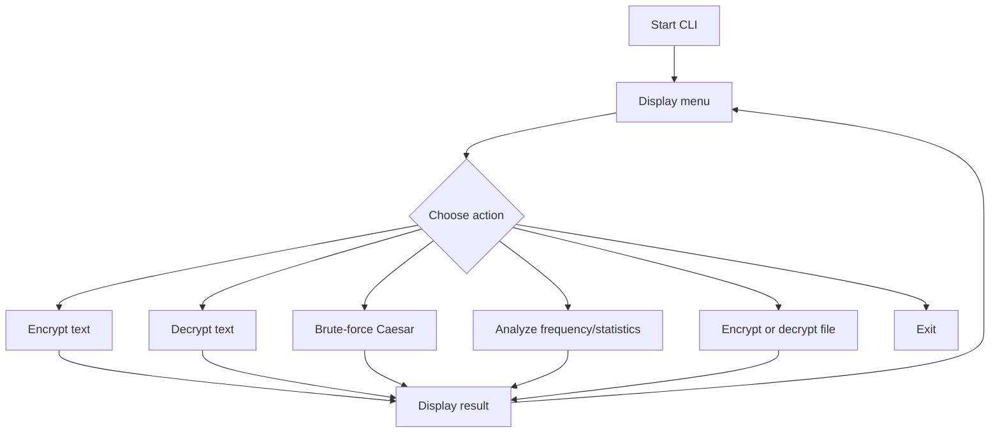

# Basic Encryption & Decryption

Project 2 in a cybersecurity learning portfolio. This project teaches encryption and decryption fundamentals using classical ciphers, starting with Caesar Cipher and expanding into analysis features.

## Features

- Caesar Cipher encryption
- Caesar Cipher decryption
- User-defined shift key
- Brute-force Caesar decoder
- Frequency analysis demonstration
- Encryption statistics
- Menu-driven command-line interface
- UTF-8 text file encryption and decryption
- Logging without storing sensitive plaintext/ciphertext
- Unit tests for functional, edge, invalid-input, and security-focused behavior

## Requirement Analysis

Encryption converts readable plaintext into unreadable ciphertext using an algorithm and key. Decryption reverses that process when the correct key and algorithm are known.

This project uses Caesar Cipher for education. Caesar Cipher is not secure for real-world protection because an attacker can brute-force all possible shifts quickly, but it is excellent for learning substitution, keys, encryption flow, and cryptanalysis basics.

## Cryptography Concepts

### Encryption

Encryption protects confidentiality by converting plaintext into ciphertext. Only someone with the correct key and algorithm should be able to recover the original message.

### Decryption

Decryption converts ciphertext back into plaintext. For Caesar Cipher, decryption uses the same shift key in the opposite direction.

### Hashing

Hashing is different from encryption. A hash function creates a fixed-size one-way digest. It is not decrypted. Password storage normally uses password hashing algorithms such as Argon2id, bcrypt, or scrypt, not reversible encryption.

### Symmetric Encryption

Symmetric encryption uses the same key to encrypt and decrypt. AES and ChaCha20 are modern examples. Caesar Cipher is also symmetric in a historical and educational sense.

### Asymmetric Encryption

Asymmetric encryption uses a public key and a private key. RSA and elliptic-curve cryptography are examples. It is commonly used for secure key exchange, digital signatures, and identity verification.

### CIA Triad

- **Confidentiality:** prevent unauthorized reading of data.
- **Integrity:** prevent or detect unauthorized modification.
- **Availability:** ensure systems and data remain accessible when needed.

Encryption mainly supports confidentiality. Hashes, MACs, and digital signatures support integrity.

### Caesar Cipher

Caesar Cipher shifts each alphabetic character by a fixed number. With shift `3`, `A` becomes `D`, `B` becomes `E`, and `HELLO` becomes `KHOOR`.

### Vigenere Cipher

Vigenere Cipher uses a repeated keyword to apply different shifts across the message. It is stronger than Caesar Cipher historically, but still insecure today.

### AES

AES is a modern symmetric block cipher used widely in real systems. Secure modes such as AES-GCM provide confidentiality and integrity when used correctly.

### RSA

RSA is an asymmetric algorithm based on mathematical difficulty around large prime numbers. Modern systems use RSA carefully with secure padding such as OAEP or PSS.

## Roadmap

1. Create professional project structure.
2. Implement Caesar Cipher encryption.
3. Implement Caesar Cipher decryption.
4. Add a menu-driven command-line interface.
5. Add brute-force decoding and frequency analysis.
6. Add encryption statistics.
7. Add file encryption support for text files.
8. Add tests for normal, edge, invalid, and security-focused cases.
9. Add complete documentation, resume content, LinkedIn content, and viva Q&A.

## Architecture

```text
Basic-Encryption-Decryption/
├── src/
│   └── encryption_tool/
│       ├── __init__.py
│       ├── caesar.py
│       ├── analysis.py
│       ├── file_crypto.py
│       └── cli.py
├── tests/
│   └── test_caesar.py
├── docs/
│   ├── architecture.md
│   └── internship_report.md
├── README.md
├── requirements.txt
├── LICENSE
└── .gitignore
```

## Program Flow



## Function Breakdown

| Function | Purpose |
| --- | --- |
| `encrypt()` | Encrypts plaintext using Caesar Cipher. |
| `decrypt()` | Decrypts Caesar Cipher text using the original shift key. |
| `normalize_shift()` | Converts any integer shift into the Caesar range `0-25`. |
| `brute_force()` | Attempts all possible Caesar shifts. |
| `frequency_analysis()` | Counts how often each English letter appears. |
| `calculate_statistics()` | Counts letters, digits, spaces, symbols, and total characters. |
| `encrypt_file()` | Encrypts a UTF-8 text file. |
| `decrypt_file()` | Decrypts a UTF-8 text file. |
| `main()` | Runs the menu-driven CLI. |

## Security Warning

This project is for learning cryptography concepts. Caesar Cipher and Vigenere Cipher are not secure for protecting real data. Real systems should use vetted cryptographic libraries and modern algorithms such as AES-GCM, ChaCha20-Poly1305, RSA-OAEP, or elliptic-curve cryptography depending on the use case.

## Installation

Use Python 3.10 or newer.

```bash
python -m pip install -e .
```

## Quick Start

```bash
encryption-tool
```

Development mode without installation:

```bash
set PYTHONPATH=src && python -m encryption_tool.cli
```

## Run Tests

```bash
set PYTHONPATH=src && python -m unittest discover -s tests
```

## Sample Outputs

### Encryption

```text
Plaintext:  HELLO
Shift:      3
Ciphertext: KHOOR
```

### Decryption

```text
Ciphertext: KHOOR
Shift:      3
Plaintext:  HELLO
```

### Brute Force

```text
Shift  1: JGNNQ
Shift  2: IFMMP
Shift  3: HELLO
```

## Test Cases

| Test | Expected Result |
| --- | --- |
| `encrypt("HELLO", 3)` | `KHOOR` |
| `decrypt("KHOOR", 3)` | `HELLO` |
| `encrypt("XYZ xyz", 3)` | `ABC abc` |
| `encrypt("Decode Labs 2026!", 5)` | `Ijhtij Qfgx 2026!` |
| `encrypt("", 3)` | Empty string |
| non-integer shift | `TypeError` |
| `None` text | `ValueError` |

## Resume Project Description

Built a Python-based Basic Encryption & Decryption toolkit demonstrating Caesar Cipher encryption, decryption, user-defined shift keys, brute-force decoding, frequency analysis, encryption statistics, file encryption support, logging, and unit testing. Designed the project with a modular package structure, secure coding practices, documentation, and GitHub-ready workflow.

## LinkedIn Project Description

Completed Project 2 in my cybersecurity learning journey: **Basic Encryption & Decryption**.

This Python project demonstrates Caesar Cipher encryption and decryption, user-defined shift keys, brute-force decoding, frequency analysis, text statistics, file encryption support, and unit testing. The project helped me understand encryption, decryption, cryptographic keys, substitution ciphers, and why classical ciphers are not secure for real-world systems.

## Viva Questions And Answers

**Q1. What is encryption?**  
Encryption converts readable plaintext into unreadable ciphertext using an algorithm and key.

**Q2. What is decryption?**  
Decryption reverses ciphertext back into plaintext using the correct key and algorithm.

**Q3. Is Caesar Cipher secure today?**  
No. It has only 25 useful shifts and can be brute-forced quickly.

**Q4. What type of cipher is Caesar Cipher?**  
It is a substitution cipher.

**Q5. What is a cryptographic key?**  
A key is secret or controlled input that changes how an encryption algorithm transforms data.

**Q6. What is symmetric encryption?**  
It uses the same key for encryption and decryption.

**Q7. What is asymmetric encryption?**  
It uses a public key and private key pair.

**Q8. What is AES?**  
AES is a modern symmetric encryption algorithm widely used for protecting real data.

**Q9. What is RSA?**  
RSA is an asymmetric cryptographic algorithm used for encryption, key exchange, and signatures when implemented correctly.

**Q10. Why should developers avoid custom cryptography?**  
Cryptography is easy to implement incorrectly. Production systems should use vetted libraries and modern algorithms.
