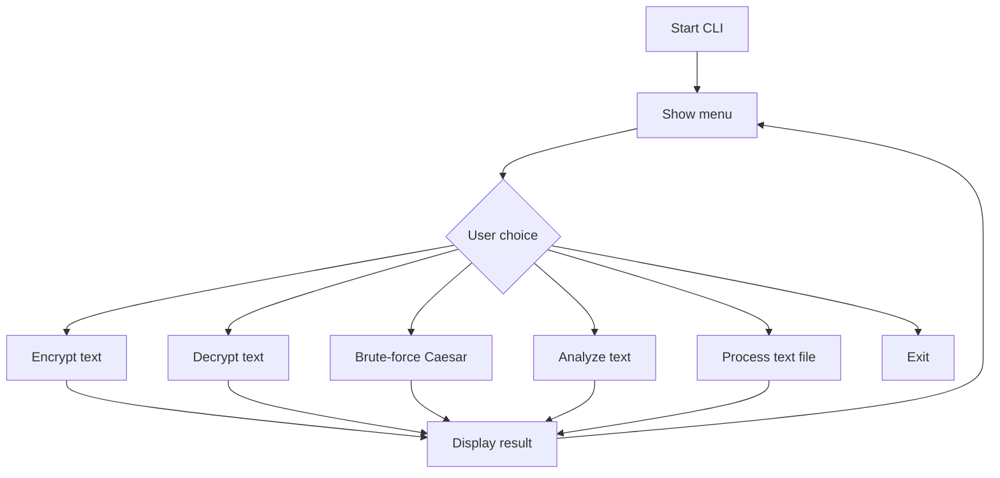

# Project Architecture

## Input, Process, Output

| Stage | Description |
| --- | --- |
| Input | User provides plaintext/ciphertext and a numeric shift key. |
| Process | The program validates input, applies cipher logic, and computes statistics. |
| Output | The program displays encrypted text, decrypted text, analysis, or file results. |

## Program Flow



## Function Breakdown

| Function | Responsibility |
| --- | --- |
| `normalize_shift()` | Validates and normalizes a shift key. |
| `encrypt()` | Converts plaintext to ciphertext using Caesar Cipher. |
| `decrypt()` | Converts ciphertext back to plaintext. |
| `brute_force()` | Shows all possible Caesar shifts. |
| `calculate_statistics()` | Counts letters, digits, symbols, and spaces. |
| `frequency_analysis()` | Counts letter frequency for cryptanalysis learning. |
| `main()` | Runs the menu-driven CLI. |

## Pseudocode

```text
START
DISPLAY menu
READ user choice
IF choice is encrypt:
    READ plaintext
    READ shift
    VALIDATE shift
    FOR each character:
        IF character is alphabetic:
            shift within A-Z or a-z
        ELSE:
            keep character unchanged
    DISPLAY ciphertext
IF choice is decrypt:
    repeat encryption logic using negative shift
IF choice is brute force:
    try every shift from 1 to 25
IF choice is statistics:
    count text properties
REPEAT until user exits
END
```
